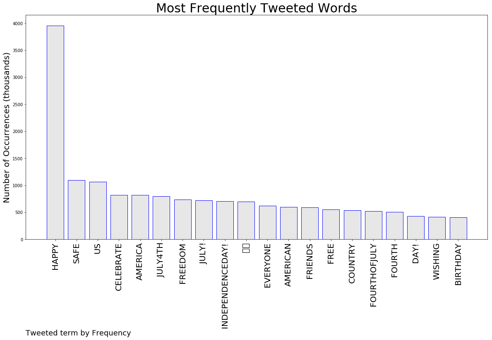
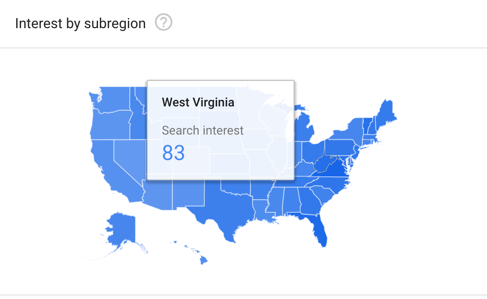
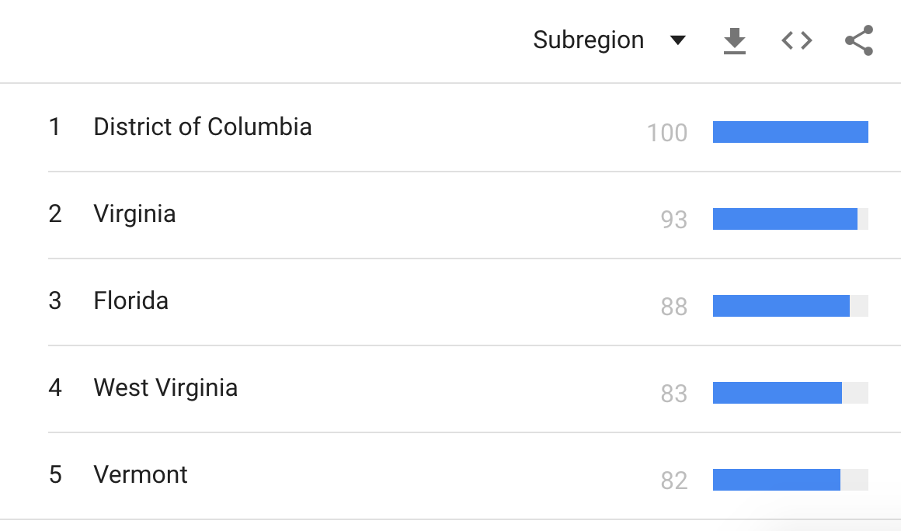
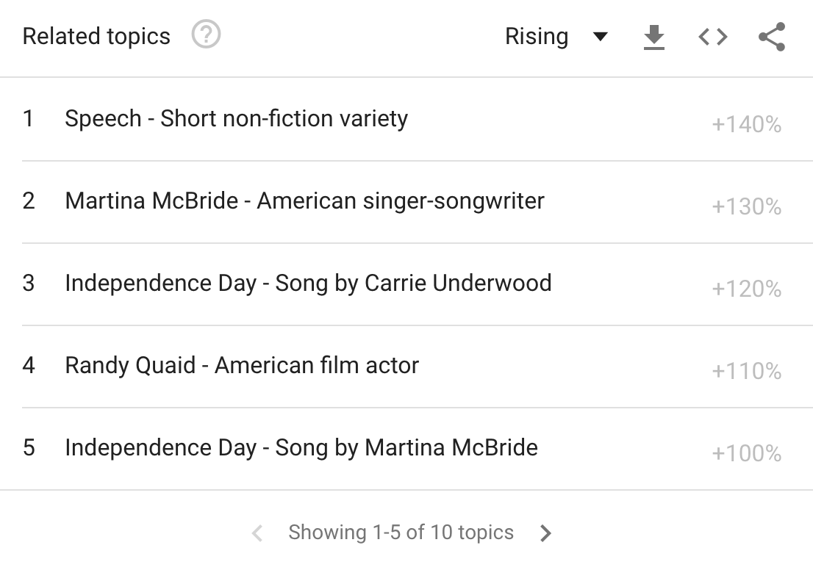
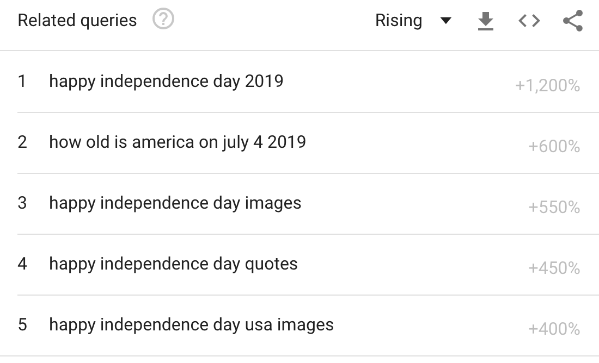
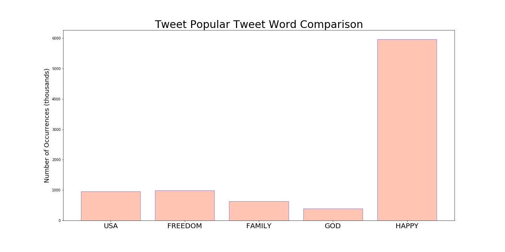
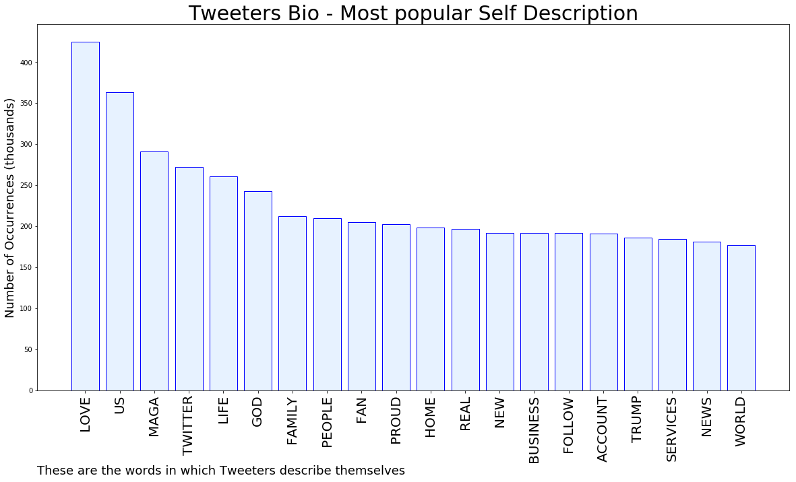

# MURCHIE85 TWITTER PROCESSING 

&#x1F34E; **TOPIC = "IndependenceDay"**

## AUTOMATED RESEARCH SUMMARY

  

<b> This repo is for pulling metrics on a given keyword or hashtag and performs a series of reporting and analysis.</b>

|                **Sample-Tweets**        |
| :-------------: |
| 
RT @ArmyChiefStaff: Happy Birthday, America!  Today marks our nation’s 243rd birthday. From the Revolutionary War to today, Soldiers have d…
 
RT @LakeMiTechCon: We want to wish everyone a happy and safe #IndependenceDay! Happy #FourthofJuly! Enjoy the day! #michED #edtech #celebra…
 
As we pause this #FourthOfJuly to celebrate our country with family and friends, take a moment to #pray for our loc… https://t.co/ncAWhI81Wg
 |

The most popular user is: **RobertC58975273**

 RT @OANN: One America News will have complete coverage of President Donald Trump’s “Salute to America” in Washington, D.C. Join us in celeb…

## GOOGLE SEARCH DEMOGRAPHICS 

Tweeting demographic           | Countries
:-------------------------:|:-------------------------:
  |  
 

## RELATED TOPICS  & QUERIES 

topics          | searches
:-------------------------:|:-------------------------:
  |  

 
 

## RELATED METRICS
 

| Metric | Value |
| ------------- | ------------- |
| #1 Most tweeted to  | **USArmy** |
| #2 Most tweeted to  | **VP** |
| #3 Most tweeted to  | **realDonaldTrump** |
| NewProfiles (less than 10 days) | 1.0%  |
| Tweeters with < 10 followers  | 5.89%|
| Tweeters with > 1000000 followers  | 0.11%  |

 

## MOST POPULAR TWEET TERMS 
 

| Popularity Rank  | Term |
| ------------- | ------------- |
| first  | **HAPPY**  |
| second  | **SAFE**  |
| third  | **US** |
| fourth  | **CELEBRATE**  |
| fifth  | **AMERICA**  |

 

## Twitter Bio Analysis

### SENTIMENT ANALYSIS

VIEWS WERE : **SUBJECTIVE**  (60.0%) & **NEGATIVELY-SUBJECTIVE** (13.33%) **OBJECTIVE** (26.67%)

### TWEET SAMPLE 

Random value picked from array: 

RT @LakeMiTechCon: We want to wish everyone a happy and safe #IndependenceDay! Happy #FourthofJuly! Enjoy the day! #michED #edtech #celebra…

### MOST RETWEETED

The most retweeted user is: **RobertC58975273**

 RT @OANN: One America News will have complete coverage of President Donald Trump’s “Salute to America” in Washington, D.C. Join us in celeb…

### CONCLUSION & EXTERNAL ANALYSIS

*This is my [Adam McMurchie`s] opinion on the data from the tweets, it serves as no objective truth.Since the tweets themselves are a mixture of fact & opinion.
 

Authors analytical summary on request.

**RECOMMENDATIONS** WILL BE UPDATED IN NEXT  24 HOURS 
 